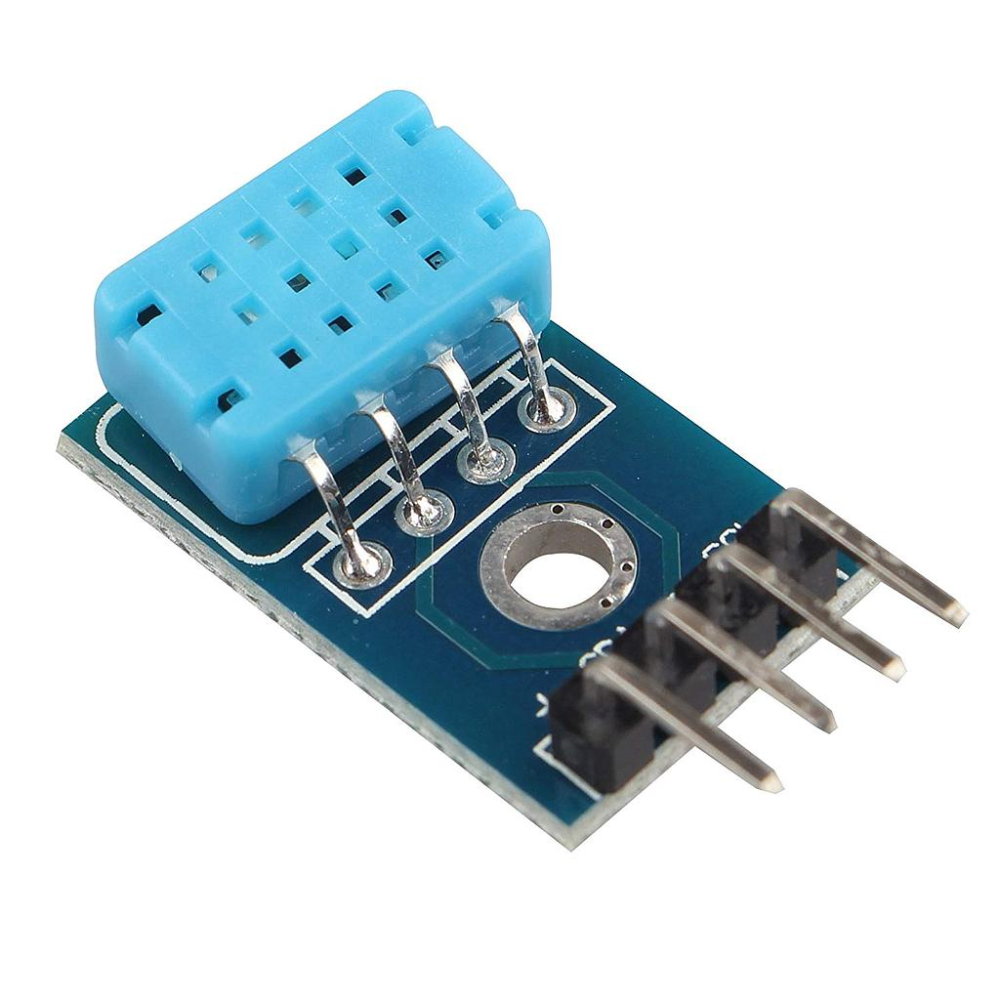
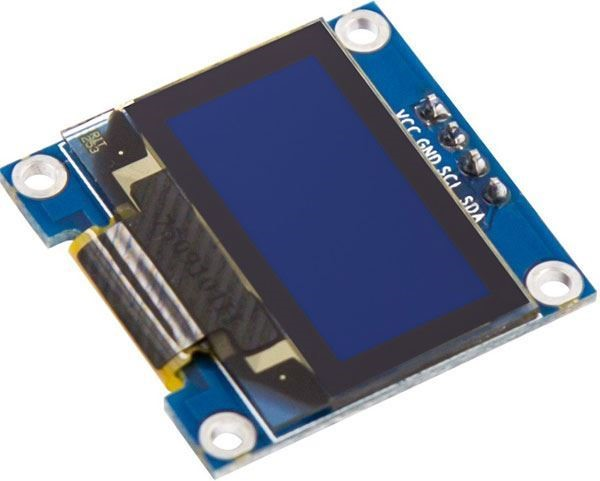
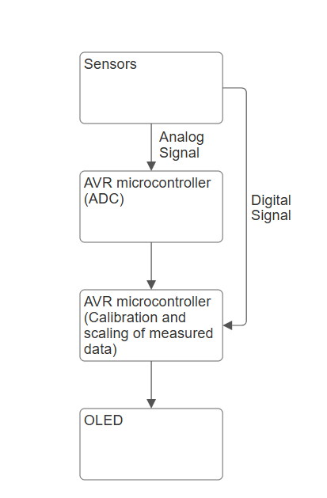

# Indoor air quality monitoring system

## Team & Contribution
* X Ritschel (xxx)
* Ivan Pavlov (Particulate sensor)
* Matúš Repáš (Pressure sensor)
* Anton Panteleev (Digital Temperature and Humidity Sensor, GitHub management)

## Project Overview

## Objectives

## Components Used

### 1. Arduino UNO

* Central controller for processing data from sensors and managing outputs.

  
### 2. Sensors:

* Sharp GP2Y1010AU0F (Optical Dust Sensor)

  

* MQ-5 (Gas Sensor)

* DHT12 (Digital Temperature and Humidity Sensor)

### 3. Output Devices:

* OLED Display

## System Block Diagram

## How It Works

## Software Description

The main.c file is written for a microcontroller and handles communication with several connected sensors and modules. It utilizes libraries for I2C (twi.h), OLED display control (oled.h), and timer management (timer.h).

Key functionalities include:

* Reading sensor's data

* Dislapying information on an OLED display

## Possible Improvements

## References and tools
