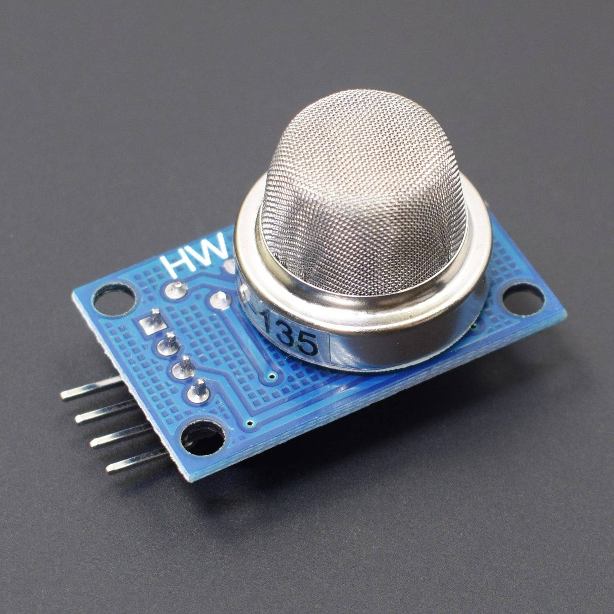
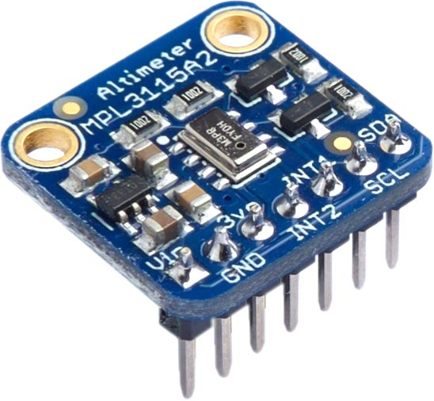
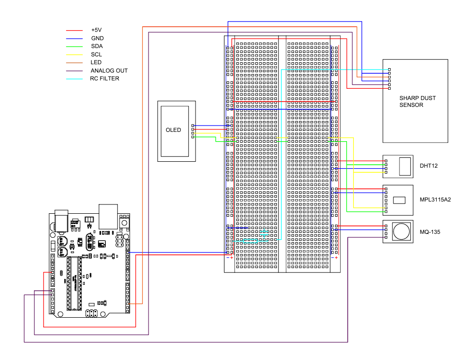
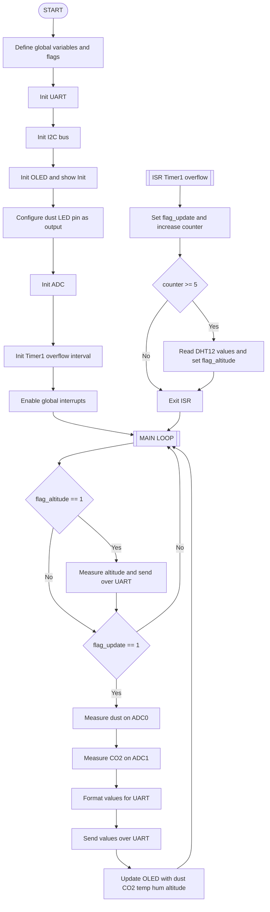
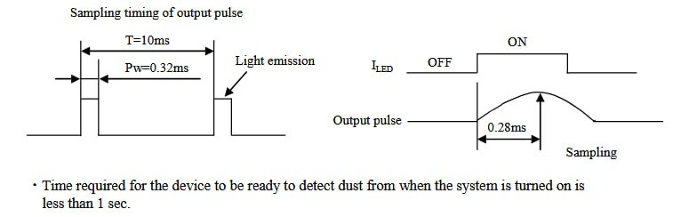

# Indoor air quality monitoring system

## Team & Contribution
* Natan Ritschel (CO2 sensor)
* Ivan Pavlov (Particulate sensor)
* Matúš Repáš (Altitude sensor)
* Anton Panteleev (Digital Temperature and Humidity Sensor, GitHub management)

## Project Overview

This project implements an indoor air-quality monitoring system based on the ATmega328P (Arduino Uno).
The device continuously measures particulate concentration (dust), CO₂ level, temperature, humidity and altitude, using a combination of analog and digital sensors. All data is processed in real time and displayed on an OLED screen, while detailed measurements are sent over UART for debugging or logging.

The system demonstrates efficient integration of multiple sensor interfaces including ADC, I²C and GPIO timing control.

## Components Used

### 1. Arduino UNO

* Central controller for processing data from sensors and managing outputs.

  
### 2. Sensors:

* Sharp GP2Y1010AU0F (Optical Dust Sensor)

  

* MQ-135 (Gas Sensor)
  * This sensor is sensitive to heat and lots of other aspects as concentration of amonia, CO2, CO, acetone, toluene and alcohol
  * To properly calibrate it needs to preheat for 24 hours 


* DHT12 (Digital Temperature and Humidity Sensor)


* MPL3115A2 (Digital barometric pressure, altitude and temperature sensor)



### 3. Output Devices:

* OLED Display


## Wiring Diagram



## System Block Diagram




## Software Description

The firmware is written in bare-metal C for the ATmega328P (Arduino Uno, 16 MHz).  
It combines several environmental sensors into a single air-quality monitoring node:

* Sharp optical dust sensor on **ADC0** with IR LED timing control on **PD2**
* CO₂ sensor on **ADC1**, read via ADC and converted to ppm
* DHT12 temperature & humidity sensor over **I²C (0x5C)**
* Altitude sensor over **I²C (0x60)**
* SSD1306 OLED display over **I²C**
* UART at **115200 baud** for debug output

Time behaviour is driven by **Timer1 overflow interrupts**:

* every **1 second** → Dust + CO₂ + DHT12 + OLED update  
* every **5 seconds** → Altitude update  

The main loop is fully blocking but reacts only to flags set by the timer ISR.

---

### 1. System initialisation

At power-up the firmware configures communication peripherals, display, ADC and timer:

```c
int main(void)
{
    uart_init(UART_BAUD_SELECT(115200, F_CPU));
    twi_init();

    oled_init(OLED_DISP_ON);
    oled_clrscr();
    oled_charMode(NORMALSIZE);
    oled_gotoxy(0, 0);
    oled_puts("Dust+CO2+DHT+Alt");
    oled_gotoxy(0, 2);
    oled_puts("Init...");
    oled_display();

    gpio_mode_output(&DDRD, LED_PIN);
    gpio_write_high(&PORTD, LED_PIN);   // LED off (active low)

    adc_init();

    tim1_ovf_1sec();
    tim1_ovf_enable();

    sei();   // global interrupts
}
```

Initial UART message:

```c
uart_puts("Optical Dust + CO2 + DHT12 + Alt sensor started\r\n");
```

---

### 2. Timer-based measurement scheduler

Periodic measurements are triggered by Timer1 overflow:

```c
ISR(TIMER1_OVF_vect)
{
    static uint8_t n_ovfs = 0;

    flag_update = 1;       // every 1 second
    n_ovfs++;

    if (n_ovfs >= 5)
    {
        n_ovfs = 0;

        twi_readfrom_mem_into(DHT_ADR, DHT_HUM_MEM, dht12_values, 5);
        flag_altitude = 1; // every 5 seconds
    }
}
```

Two volatile flags coordinate the workflow:

* `flag_update` – 1 s cycle: dust, CO₂, DHT12 values and OLED update  
* `flag_altitude` – 5 s cycle: altitude measurement and UART print  

Time-critical operations occur inside or are triggered by the ISR.

---

### 3. Main measurement cycle

The main loop alternates between two tasks:

```c
while (1)
{
    if (flag_altitude) { ... }
    if (flag_update)  { ... }
}
```

#### 3.1 Altitude measurement (every 5 s)

When `flag_altitude` is set:

* Sensor is switched into altitude mode  
* Conversion delay of 4 seconds  
* 3 altitude bytes are read via I²C  
* 20-bit altitude value is decoded and converted to meters  

```c
if (flag_altitude)
{
    flag_altitude = 0;

    mode_altitude();
    _delay_ms(4000);

    twi_readfrom_mem_into(ADD, ATD_REG, altitude_raw, 3);

    int32_t tHeight = ((int32_t)altitude_raw[0] << 16) |
                      ((int32_t)altitude_raw[1] << 8)  |
                       (int32_t)altitude_raw[2];

    tHeight >>= 4;
    altitude_m = (int16_t)(tHeight / 16);

    sprintf(uart_buffer, "Altitude: %d m\r\n", altitude_m);
    uart_puts(uart_buffer);
}
```

---

#### 3.2 Dust, CO₂, temperature, humidity and OLED update (every 1 s)

##### 3.2.1 Dust sensor (Sharp GP2Y)

Precise IR LED timing:

```c
gpio_write_low(&PORTD, LED_PIN);   // LED ON
_delay_us(LONG_DELAY);

adc_value = adc_read(DUST_ADC_CH);

_delay_us(SHORT_DELAY);
gpio_write_high(&PORTD, LED_PIN);  // LED OFF
```



Voltage conversion:

```c
voltage = adc_value * (5.0f / 1024.0f);
```

Dust density:

```c
dustDensity = 0.17f * voltage;  
```

##### 3.2.2 CO₂ concentration

`getCO2ppm()` processes ADC1 readings:

```c
float getCO2ppm(void)
{
    uint32_t sum = 0;

    for (int i = 0; i < NUM_SAMPLES; i++)
        sum += adc_read(CO2_ADC_CH);

    uint16_t raw = (uint16_t)(sum / NUM_SAMPLES);
    float V = raw * (5.0f / 1023.0f);

    if (V < 0.1f || V > 4.9f)
        return 0.0f;

    float RS = (5.0f - V) * RL / V;
    float ratio = RS / R0;

    return 40.0f * powf(ratio, -2.77f);
}
```

Formatting:

```c
co2_ppm = getCO2ppm();
co2_int = (long)co2_ppm;
co2_dec = abs((int)((co2_ppm - (float)co2_int) * 100.0f));
```

##### 3.2.3 DHT12 values

The ISR fills:

* `dht12_values[0]` – RH integer  
* `dht12_values[1]` – RH decimal  
* `dht12_values[2]` – temperature integer  
* `dht12_values[3]` – temperature decimal  

Formatted for display:

```c
sprintf(dht_str, "%u.%u C", dht12_values[2], dht12_values[3]);
sprintf(dht_str, "%u.%u %%", dht12_values[0], dht12_values[1]);
```

##### 3.2.4 UART output

```c
snprintf(uart_buffer, sizeof(uart_buffer),
         "V: %s V | Dust: %s mg/m3 | CO2: %ld.%02d ppm\r\n",
         volt_str, dust_str, co2_int, co2_dec);
uart_puts(uart_buffer);
```

---

### 4. UI rendering on OLED

The OLED is used as a simple dashboard:

```c
oled_clrscr();
oled_puts("Air Quality System");

sprintf(co2_str, "CO2:%ld.%02dppm", co2_int, co2_dec);
oled_puts(co2_str);

sprintf(oled_buf, "D: %s mg/m3", dust_str);
oled_puts(oled_buf);

sprintf(dht_str, "%u.%u C", dht12_values[2], dht12_values[3]);
oled_puts(dht_str);

sprintf(dht_str, "%u.%u %%", dht12_values[0], dht12_values[1]);
oled_puts(dht_str);

sprintf(oled_buf, "Alt: %d m", altitude_m);
oled_puts(oled_buf);

oled_display();
```

Layout:

* Title  
* CO₂ value  
* Temperature  
* Humidity  
* Dust concentration  
* Altitude  

Screen refresh rate: **1 Hz**

---

### 5. Design characteristics

* **Timer-driven sampling**  
  Strict 1 s and 5 s intervals based on Timer1 overflow flags.

* **Precise dust sensor LED timing**  
  Required microsecond accuracy for Sharp GP2Y.

* **Floating-point calculations**  
  Used for CO₂ power-law calibration and dust-density conversion.

* **Modular structure**  
  Sensor interfaces (ADC, TWI), scheduler (Timer1 ISR), computing (getCO2ppm), and UI (OLED) are separated.

* **Single consolidated screen**  
  All environmental parameters visible simultaneously without navigation.

## Project Poster


## Resources and References

* [Datasheet of Optical Dust Sensor](resources/datasheet%20of%20optical%20dust%20sensor.pdf)

* [How to Interface With Optical Dust Sensor](https://www.instructables.com/How-to-Interface-With-Optical-Dust-Sensor/)

* [AVR course at Brno University of Technology](https://github.com/tomas-fryza/avr-labs)

* [Datasheet of Gas Sensor](resources/MQ-135_datasheet.pdf)

* Open AI
